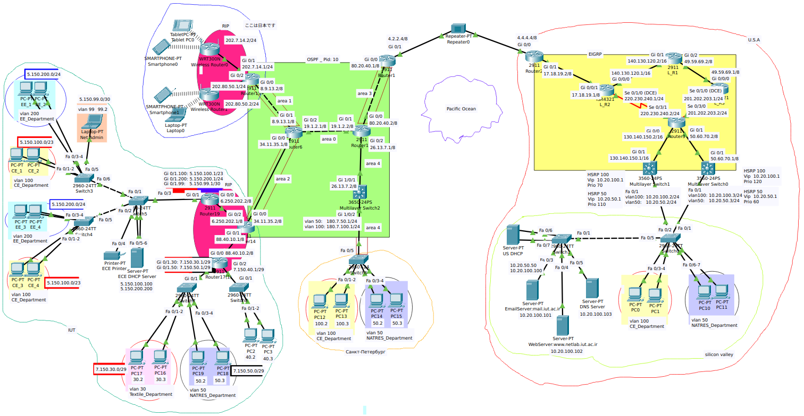

# Cisco Network Configuration

This repository contains a Packet Tracer project that demonstrates the configuration of various interconnected networks, including Internet Core, USA, Russia, and Isfahan University of Technology (IUT) networks. The project showcases different networking protocols, devices, and services implemented within each network. Below is an overview of each network's architecture and configuration.

 

## Internet Core Network

The Internet Core network serves as the central hub connecting all other networks, including USA, Russia, and IUT networks. The network uses the OSPF protocol for routing. It consists of:
- 5 routers
- 1 layer-3 switch
- 4 OSPF areas

## USA Network

The USA network employs the EIGRP protocol for its core routing. It features:
- 5 routers
- 2 layer-3 switches
- Silicon Valley network, including VLANs 50 (NATRES Department) and 100 (CE Department)
- 2 layer-2 switches
- DHCP server for VLANs 50 and 100
- DNS server
- Mail server
- Web server

The connection between the Silicon Valley network and the Core network is established using HSRP for load balancing and prioritizing between the two layer-3 switches. STP protocol is configured to prevent packet loops. The USA network is connected to the Internet Core network via a repeater.

## Russia Network

The Russia network consists of a layer-2 switch and two VLANs: VLAN 50 (NATRES Department) and VLAN 100 (CE Department). The layer-2 switch in the Russia Network is connected to a layer-3 switch in the Internet Core network.

## Japan Network

The Japan network utilizes the RIP protocol for routing. It includes:
- 1 router
- 2 wireless routers

The network's connection to the Internet Core network is facilitated by a router shared between the two networks. This router redistributes both OSPF and RIP protocols.

## Isfahan University of Technology (IUT) Network

The IUT Network employs the RIP protocol for routing. It features:
- 3 routers
- Connection to the Internet Core network through a shared router that redistributes OSPF and RIP protocols
- 5 VLANs: VLAN 100 (CE Department), VLAN 200 (EE Department), VLAN 30 (Textile Department), VLAN 50 (NATRES Department), and VLAN 99 (Admin)
- DHCP server for VLANs 100 and 200

SSH is installed on routers, and SSH access in the IUT network is limited to the Admin VLAN. Unused ports are disabled and assigned to the BackHole VLAN. All devices with assigned IPs across networks can be pinged.

## Version Information

The Packet Tracer project was created using version 8.2.1.

## Screenshots

Screenshots of network diagrams, IP configurations, and other relevant details are available and can be referenced for a visual understanding of the network setup.
